# Portofolio Aplikasi
# Sistem Manajemen Jadwal Kuliah

**Nama Aplikasi:** Sistem Manajemen Jadwal Kuliah  
**Platform:** Web Application  
**Framework:** Laravel 11  
**Tanggal:** Februari 2026  

---

## Daftar Isi

1. Deskripsi Aplikasi
2. Teknologi yang Digunakan
3. Fitur Utama
4. Arsitektur Sistem
5. Data Flow Diagram (DFD)
6. Entity Relationship Diagram (ERD)
7. Struktur Database
8. Tampilan Antarmuka
9. Unit Kompetensi yang Dicakup

---

## 1. Deskripsi Aplikasi

Sistem Manajemen Jadwal Kuliah adalah aplikasi web berbasis PHP/Laravel yang memungkinkan pengguna mengelola data dosen, mata kuliah, ruangan, dan jadwal perkuliahan secara mandiri. Setiap akun memiliki data yang terisolasi satu sama lain.

Aplikasi dirancang dengan pendekatan multi-user, di mana setiap pengguna hanya dapat melihat dan mengelola data miliknya sendiri. Sistem dilengkapi dengan fitur autentikasi lengkap, log aktivitas real-time, dan antarmuka code review (*Behind The Code*) untuk keperluan pembelajaran dan presentasi.

---

## 2. Teknologi yang Digunakan

| Kategori | Teknologi | Versi | Fungsi |
|---|---|---|---|
| Backend Framework | Laravel | 11.x | MVC framework utama |
| Bahasa Pemrograman | PHP | 8.3 | Logika aplikasi server-side |
| Database | MySQL | 8.0 | Penyimpanan data relasional |
| CSS Framework | Tailwind CSS | 3.x | Styling dan layout responsif |
| JavaScript | Alpine.js | 3.x | Interaktivitas UI ringan |
| Build Tool | Vite | 5.x | Bundling aset frontend |
| Autentikasi | Laravel Breeze | 2.x | Scaffolding login/register |
| Logging | Laravel Log Facade | - | Pencatatan aktivitas aplikasi |

---

## 3. Fitur Utama

### 3.1 Manajemen Data Referensi

| Modul | Operasi | Validasi Khusus |
|---|---|---|
| Data Dosen | Tambah, Lihat, Edit, Hapus | NIP unik per akun |
| Mata Kuliah | Tambah, Lihat, Edit, Hapus | Kode MK unik per akun |
| Ruangan | Tambah, Lihat, Edit, Hapus | Nama ruangan unik per akun |
| Jadwal | Tambah, Lihat, Edit, Hapus | Deteksi konflik waktu dan ruangan |

### 3.2 Autentikasi dan Keamanan

- Registrasi dan login dengan verifikasi email
- Password di-hash menggunakan bcrypt (cost factor 12)
- Setiap route dilindungi middleware `auth` dan `verified`
- Data antar akun terisolasi melalui scope `user_id` pada setiap query
- Konfirmasi dialog sebelum penghapusan data

### 3.3 Log dan Pemantauan

- Log Viewer real-time dengan polling setiap 2 detik
- Pencatatan otomatis setiap operasi tambah, ubah, dan hapus
- Filter log berdasarkan level (INFO, WARNING, ERROR, DEBUG)
- Tampilan terminal bergaya dark mode

### 3.4 Fitur Portofolio (Behind The Code)

- Setiap halaman dilengkapi panel *Behind The Code* yang menampilkan kode sumber relevan
- Setiap snippet kode diberi label unit kompetensi SKKNI
- Halaman demo login dan register untuk code review tanpa interaksi aktif
- Halaman *About & Tools* menampilkan seluruh teknologi yang digunakan

---

## 4. Arsitektur Sistem

Aplikasi menggunakan pola arsitektur **MVC (Model-View-Controller)** bawaan Laravel dengan tambahan **Form Request** untuk validasi terpisah dan **Service Layer** untuk logika bisnis kompleks.

```
Request HTTP
    |
    v
Route (web.php)
    |
    v
Middleware (auth, verified)
    |
    v
Controller
    |-- Form Request (validasi)
    |-- Service Layer (logika bisnis, deteksi konflik)
    |-- Model / Eloquent ORM
    |        |
    |        v
    |      Database (MySQL)
    |
    v
View (Blade Template + Alpine.js)
    |
    v
Response HTTP
```

**Alur operasi CRUD:**

1. Request masuk melalui route yang dilindungi middleware
2. Controller menerima request dan meneruskan ke Form Request untuk validasi
3. Untuk operasi jadwal, logika konflik diproses di `ScheduleService`
4. Model melakukan operasi database dan Log::info/warning ditulis
5. Controller mengembalikan redirect dengan pesan sukses atau view dengan data

---

## 5. Data Flow Diagram (DFD)

### 5.1 DFD Level 0 (Context Diagram)

DFD Level 0 menggambarkan sistem secara keseluruhan sebagai satu proses tunggal dengan entitas eksternal Mahasiswa dan Database.

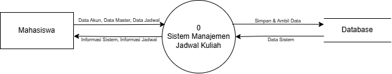

**Keterangan:**

| Aliran Data | Arah | Keterangan |
|---|---|---|
| Data Akun, Data Master, Data Jadwal | Mahasiswa -> Sistem | Input dari pengguna |
| Informasi Sistem, Informasi Jadwal | Sistem -> Mahasiswa | Output ke pengguna |
| Simpan & Ambil Data | Sistem -> Database | Operasi persistensi |
| Data Sistem | Database -> Sistem | Hasil query |

### 5.2 DFD Level 1

DFD Level 1 memperinci sistem menjadi 4 proses utama beserta aliran datanya ke masing-masing data store.


**Deskripsi Proses:**

| Proses | Nama | Fungsi |
|---|---|---|
| 1.0 | Autentikasi & Akun | Registrasi, login, verifikasi email, manajemen sesi |
| 2.0 | Kelola Data Referensi | CRUD dosen, mata kuliah, dan ruangan |
| 3.0 | Kelola Jadwal | CRUD jadwal, deteksi konflik, tampilan tabel |
| 4.0 | Kelola Profile | Update profil, ganti password, hapus akun |

---

## 6. Entity Relationship Diagram (ERD)

ERD berikut menggambarkan hubungan antar entitas dalam database aplikasi.

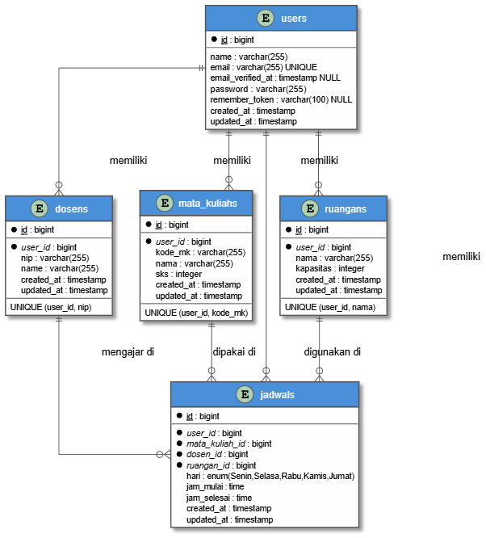

**Keterangan Relasi:**

| Relasi | Kardinalitas | Keterangan |
|---|---|---|
| users -- dosens | One to Many | Satu user memiliki banyak dosen |
| users -- mata_kuliahs | One to Many | Satu user memiliki banyak mata kuliah |
| users -- ruangans | One to Many | Satu user memiliki banyak ruangan |
| users -- jadwals | One to Many | Satu user memiliki banyak jadwal |
| dosens -- jadwals | One to Many | Satu dosen mengajar di banyak jadwal |
| mata_kuliahs -- jadwals | One to Many | Satu mata kuliah dipakai di banyak jadwal |
| ruangans -- jadwals | One to Many | Satu ruangan digunakan di banyak jadwal |

---

## 7. Struktur Database

### Tabel `users`

| Kolom | Tipe | Keterangan |
|---|---|---|
| id | bigint (PK) | Primary key auto increment |
| name | varchar(255) | Nama pengguna |
| email | varchar(255) UNIQUE | Email unik |
| email_verified_at | timestamp NULL | Waktu verifikasi email |
| password | varchar(255) | Hash bcrypt |
| remember_token | varchar(100) NULL | Token remember me |

### Tabel `dosens`

| Kolom | Tipe | Keterangan |
|---|---|---|
| id | bigint (PK) | Primary key |
| user_id | bigint (FK) | Referensi ke users, ON DELETE CASCADE |
| nip | varchar(255) | Nomor Induk Pegawai |
| name | varchar(255) | Nama dosen |
| UNIQUE | (user_id, nip) | NIP unik per akun |

### Tabel `mata_kuliahs`

| Kolom | Tipe | Keterangan |
|---|---|---|
| id | bigint (PK) | Primary key |
| user_id | bigint (FK) | Referensi ke users, ON DELETE CASCADE |
| kode_mk | varchar(255) | Kode mata kuliah |
| nama | varchar(255) | Nama mata kuliah |
| sks | integer | Jumlah satuan kredit semester |
| UNIQUE | (user_id, kode_mk) | Kode unik per akun |

### Tabel `ruangans`

| Kolom | Tipe | Keterangan |
|---|---|---|
| id | bigint (PK) | Primary key |
| user_id | bigint (FK) | Referensi ke users, ON DELETE CASCADE |
| nama | varchar(255) | Nama ruangan |
| kapasitas | integer | Kapasitas ruangan |
| UNIQUE | (user_id, nama) | Nama unik per akun |

### Tabel `jadwals`

| Kolom | Tipe | Keterangan |
|---|---|---|
| id | bigint (PK) | Primary key |
| user_id | bigint (FK) | Referensi ke users |
| dosen_id | bigint (FK) | Referensi ke dosens |
| mata_kuliah_id | bigint (FK) | Referensi ke mata_kuliahs |
| ruangan_id | bigint (FK) | Referensi ke ruangans |
| hari | enum | Senin / Selasa / Rabu / Kamis / Jumat |
| jam_mulai | time | Jam mulai kuliah |
| jam_selesai | time | Jam selesai kuliah |

Semua tabel menggunakan `ON DELETE CASCADE` sehingga penghapusan satu user akan otomatis menghapus seluruh data yang dimilikinya.

---

## 8. Tampilan Antarmuka

### 8.1 Autentikasi

**Halaman Login**

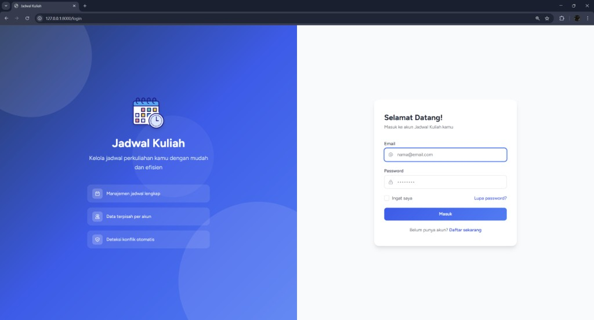

Halaman login dengan tampilan dua kolom: panel branding di kiri dan form di kanan. Mendukung remember me dan lupa password.

**Halaman Register**

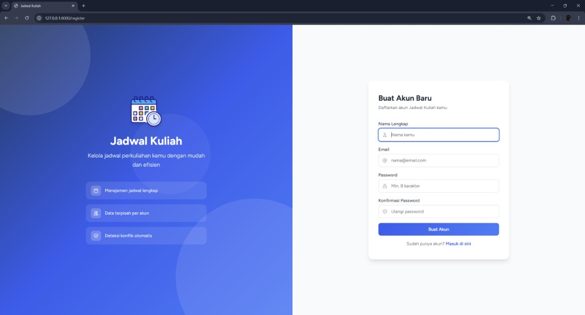

Form registrasi akun baru dengan validasi nama lengkap, email, password, dan konfirmasi password.

---

### 8.2 Dashboard

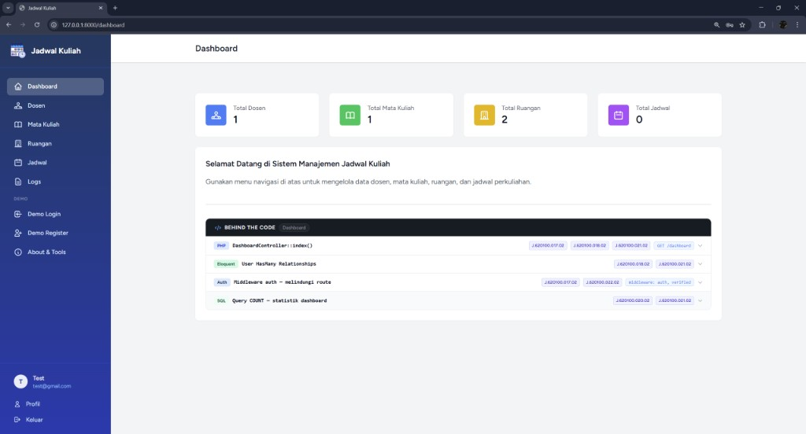

Halaman utama setelah login menampilkan 4 kartu statistik (total dosen, mata kuliah, ruangan, jadwal) beserta panel *Behind The Code*.

---

### 8.3 Modul Dosen

**Daftar Dosen**

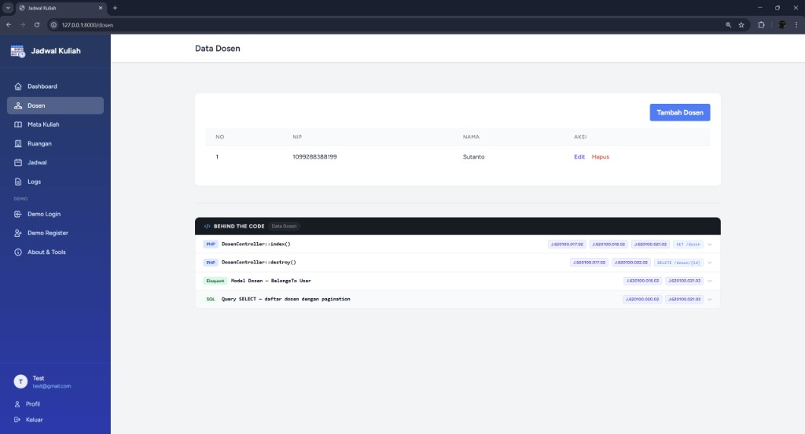

Tabel daftar dosen milik akun yang sedang login dengan tombol Tambah, Edit, dan Hapus.

**Tambah Dosen**

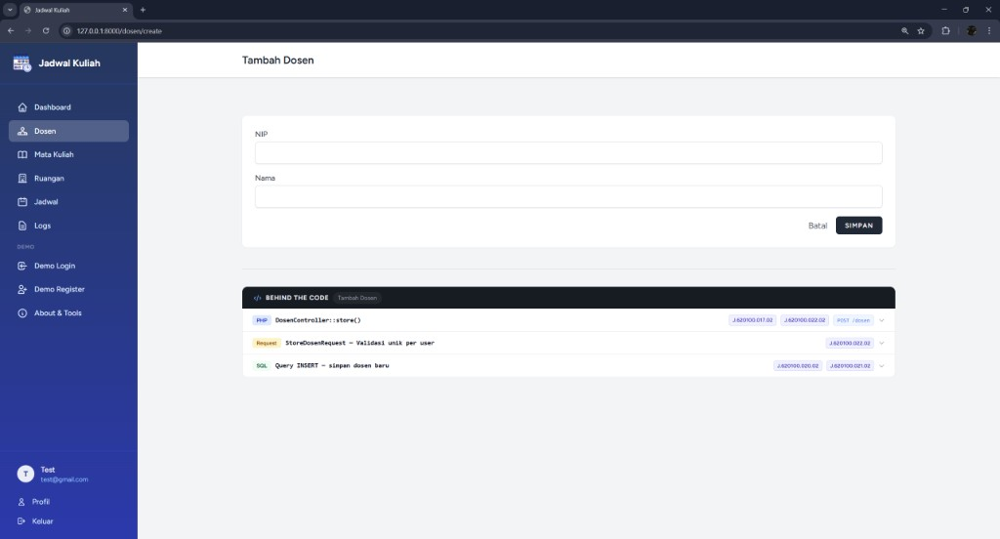

Form input NIP dan Nama dengan validasi keunikan NIP per akun menggunakan `StoreDosenRequest`.

**Edit Dosen**

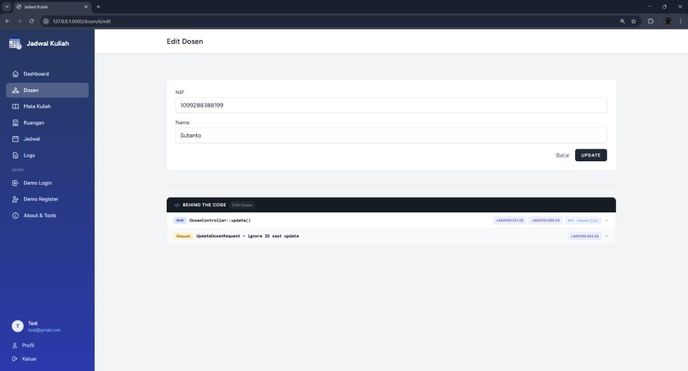

Form edit data dosen dengan validasi yang mengabaikan ID dosen yang sedang diedit (`UpdateDosenRequest`).

**Konfirmasi Hapus Dosen**

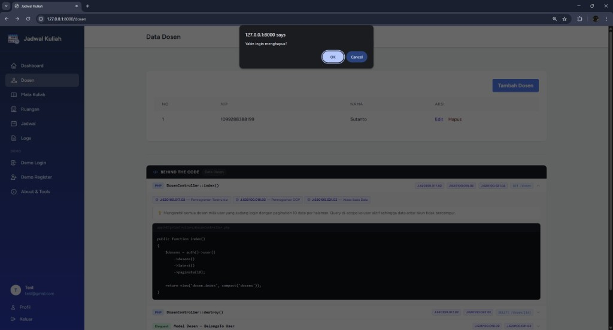

Dialog konfirmasi bawaan browser sebelum menghapus data dosen.

---

### 8.4 Modul Mata Kuliah

**Daftar Mata Kuliah**

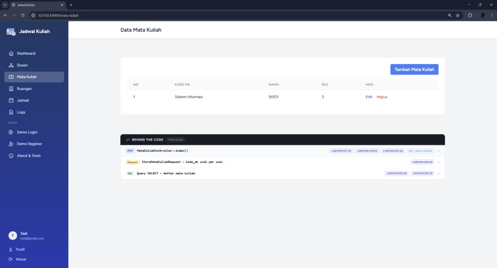

Tabel daftar mata kuliah dengan kolom Kode MK, Nama, dan SKS.

**Tambah Mata Kuliah**

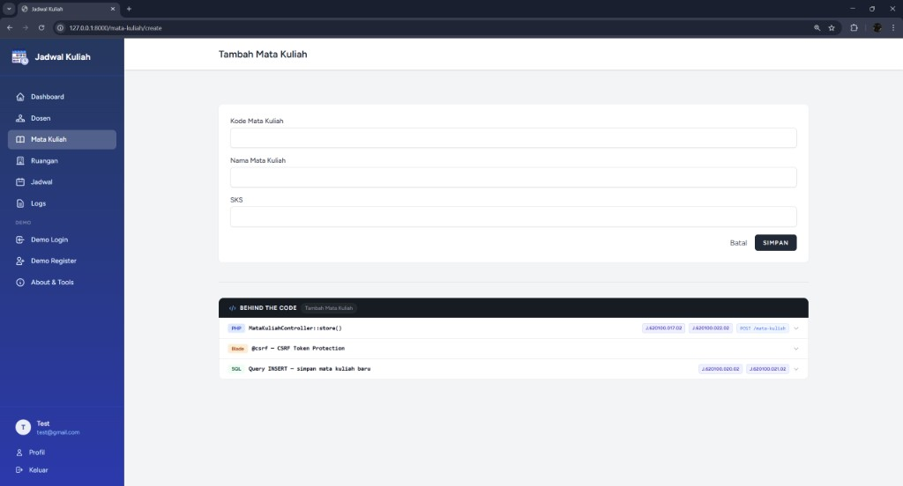

Form input kode, nama, dan jumlah SKS mata kuliah dengan perlindungan CSRF token.

**Edit Mata Kuliah**

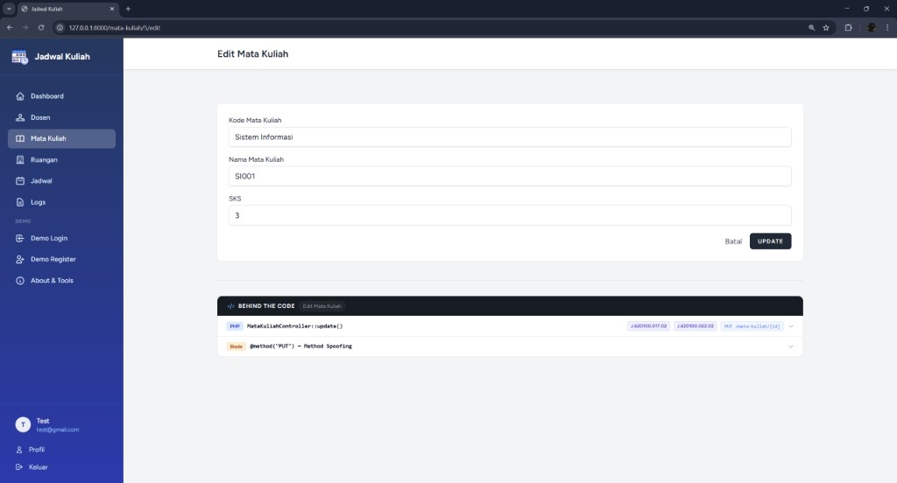

Form edit dengan method spoofing `@method('PUT')` karena HTML form hanya mendukung GET dan POST.

**Konfirmasi Hapus Mata Kuliah**

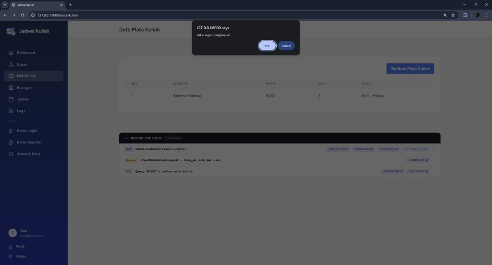

Dialog konfirmasi sebelum menghapus mata kuliah.

---

### 8.5 Modul Ruangan

**Daftar Ruangan**

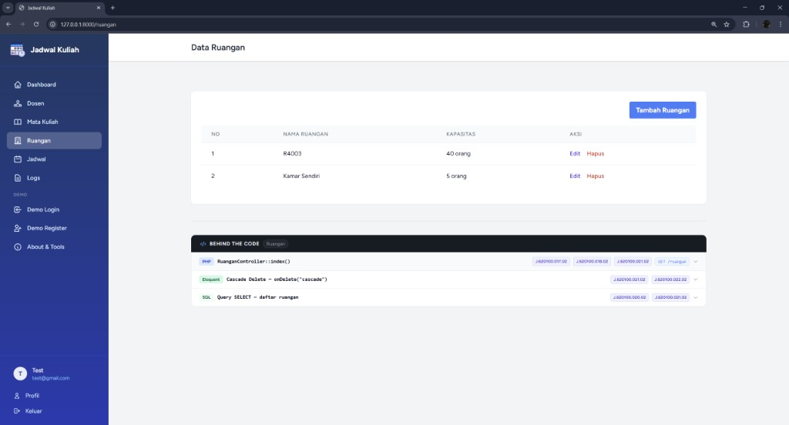

Tabel ruangan dengan informasi nama dan kapasitas.

**Tambah Ruangan**


Form input nama ruangan dan kapasitas.

**Edit Ruangan**


Form edit ruangan dengan Route Model Binding (`RuanganController::update()`).

**Konfirmasi Hapus Ruangan**

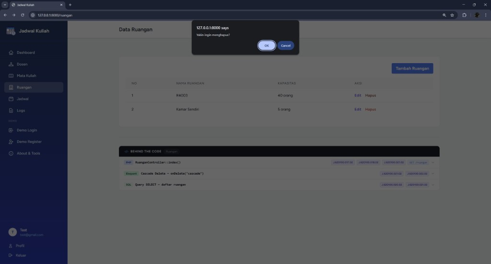

Dialog konfirmasi sebelum menghapus ruangan.

---

### 8.6 Modul Jadwal

**Daftar Jadwal**


Tabel jadwal dengan kolom Mata Kuliah, Dosen, Ruangan, Hari, dan Waktu. Menggunakan Eager Loading untuk menghindari N+1 query.

**Tambah Jadwal**

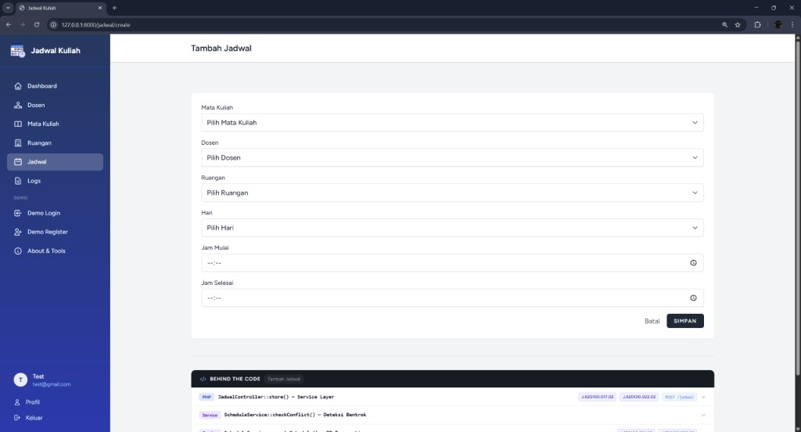

Form dengan dropdown Mata Kuliah, Dosen, Ruangan, Hari, serta input Jam Mulai dan Jam Selesai. Logika deteksi konflik diproses di `ScheduleService::checkConflict()`.

**Edit Jadwal**


Form edit jadwal dengan data terpilih sudah terisi, menggunakan `ScheduleService::updateSchedule()` dengan excludeId untuk mengabaikan jadwal yang sedang diedit.

**Jadwal Berhasil Ditambahkan**

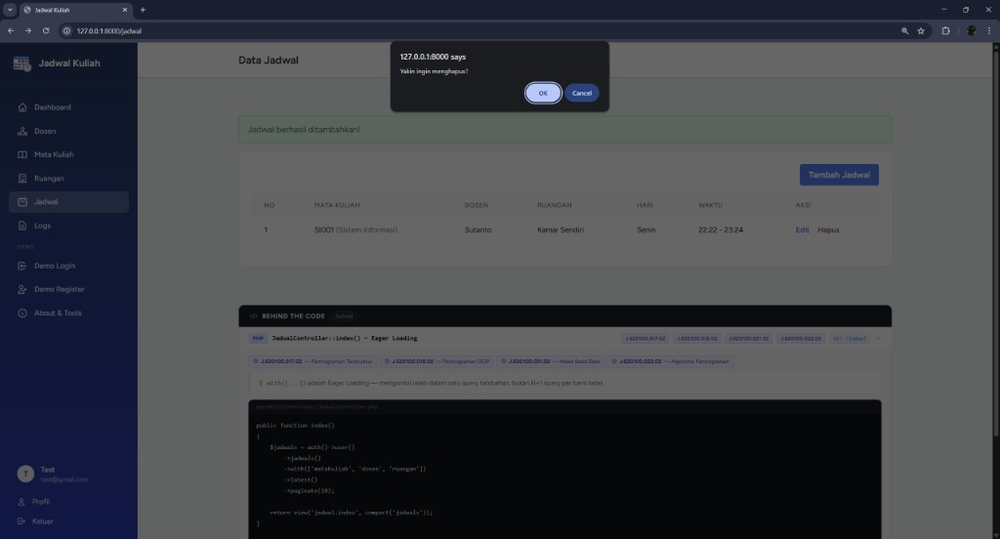

Tampilan setelah jadwal berhasil disimpan: notifikasi sukses hijau di atas tabel, data jadwal baru langsung muncul di daftar, dan konfirmasi hapus yang siap digunakan.

---

### 8.7 Log & Debug

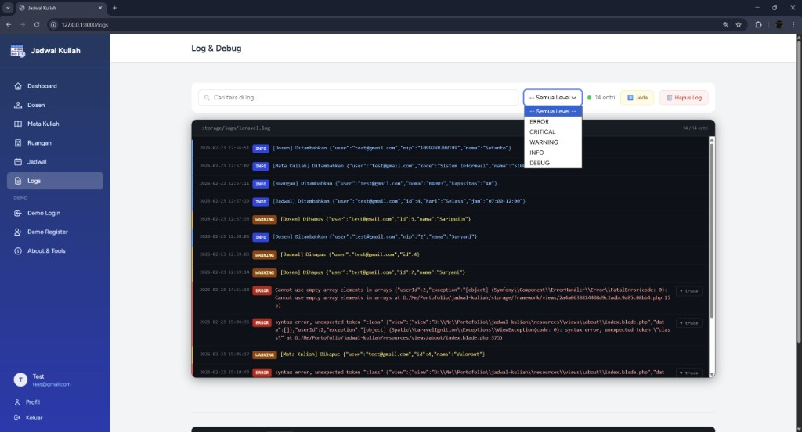

Halaman pemantauan log real-time dengan filter level (INFO, WARNING, ERROR, CRITICAL, DEBUG). Log mencatat setiap aktivitas CRUD beserta data pengguna yang melakukan aksi.

---

### 8.8 Profile

**Informasi Profile**

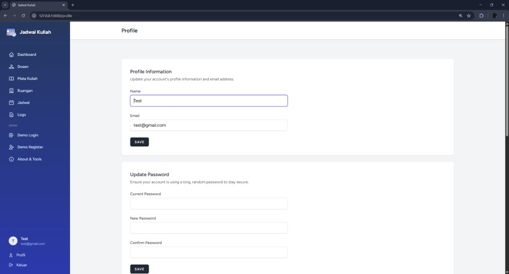

Halaman manajemen akun dengan dua section: update nama/email dan ganti password.

**Update Password dan Hapus Akun**


Section ganti password, tombol hapus akun permanen, dan panel *Behind The Code* yang menampilkan implementasi `ProfileController` beserta Cascade Delete.

---

### 8.9 Demo Login dan Register

**Demo Login**

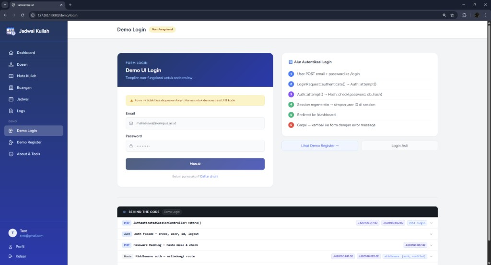

Halaman demonstrasi alur autentikasi non-fungsional. Menampilkan 6 langkah alur login beserta panel *Behind The Code* yang menjelaskan `Auth::attempt()`, hash password, dan manajemen sesi.

**Demo Register**

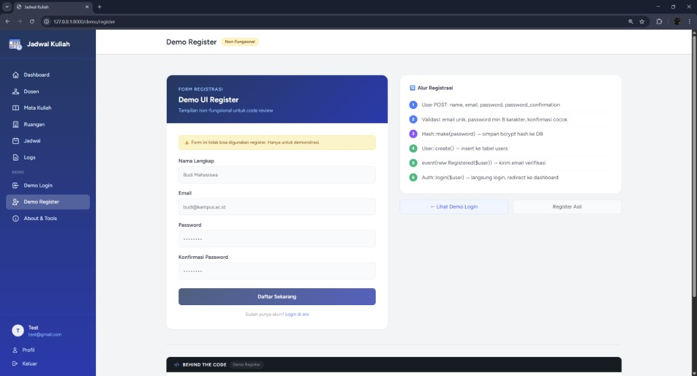

Halaman demonstrasi alur registrasi non-fungsional. Menampilkan 6 langkah alur registrasi mulai dari validasi hingga pengiriman email verifikasi.

---

### 8.10 About & Tools

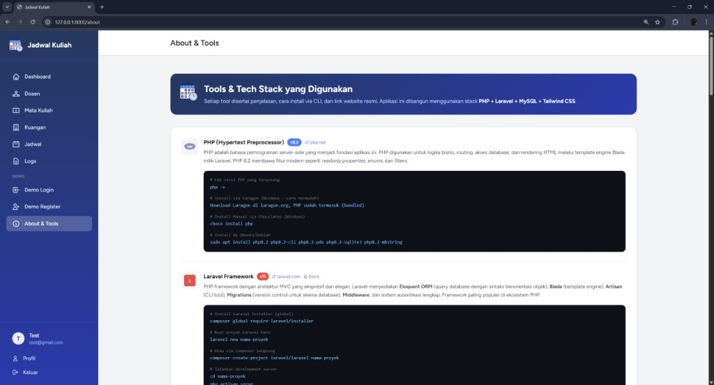

Halaman dokumentasi teknologi yang digunakan lengkap dengan penjelasan, cara instalasi via CLI, dan tabel unit kompetensi SKKNI yang dicakup oleh aplikasi.

---

## 9. Unit Kompetensi yang Dicakup

Aplikasi ini mencakup 17 unit kompetensi SKKNI Bidang Pengembangan Perangkat Lunak.

| No | Kode Unit | Judul Unit Kompetensi | Implementasi dalam Aplikasi |
|---|---|---|---|
| 1 | J.620100.001.01 | Menganalisis Tools | Halaman About & Tools |
| 2 | J.620100.002.01 | Menganalisis Skalabilitas Perangkat Lunak | Middleware, pagination, eager loading |
| 3 | J.620100.003.01 | Melakukan Identifikasi Library/Framework | Deskripsi setiap tool di About |
| 4 | J.620100.006.01 | Merancang User Experience | Seluruh antarmuka UI |
| 5 | J.620100.017.02 | Mengimplementasikan Pemrograman Terstruktur | Semua Controller (CRUD) |
| 6 | J.620100.018.02 | Mengimplementasikan Pemrograman OOP | Models, Controllers, Form Requests |
| 7 | J.620100.020.02 | Menggunakan SQL | Query di semua modul |
| 8 | J.620100.021.02 | Menerapkan Akses Basis Data | Eloquent ORM, migrations |
| 9 | J.620100.022.02 | Mengimplementasikan Algoritma Pemrograman | Deteksi konflik jadwal, hash password |
| 10 | J.620100.024.02 | Melakukan Migrasi Ke Teknologi Baru | Laravel Breeze, Vite |
| 11 | J.620100.025.02 | Melakukan Debugging | Log Viewer real-time |
| 12 | J.620100.030.02 | Menerapkan Pemrograman Multimedia | Tailwind CSS, Alpine.js |
| 13 | J.620100.032.01 | Menerapkan Code Review | Fitur Behind The Code |
| 14 | J.620100.036.02 | Melaksanakan Pengujian Kode Secara Statis | Label kompetensi per snippet |
| 15 | J.620100.044.01 | Menerapkan Alert Notification | Log::warning, Log::error |
| 16 | J.620100.045.01 | Melakukan Pemantauan Resource | Log Viewer polling real-time |
| 17 | J.620100.047.01 | Melakukan Pembaharuan Perangkat Lunak | Composer, npm, migrasi database |

---

*Dokumen ini dibuat sebagai portofolio akademik Sistem Manajemen Jadwal Kuliah.*  
*Dibangun dengan Laravel 11.x dan PHP 8.3 — 2026*
